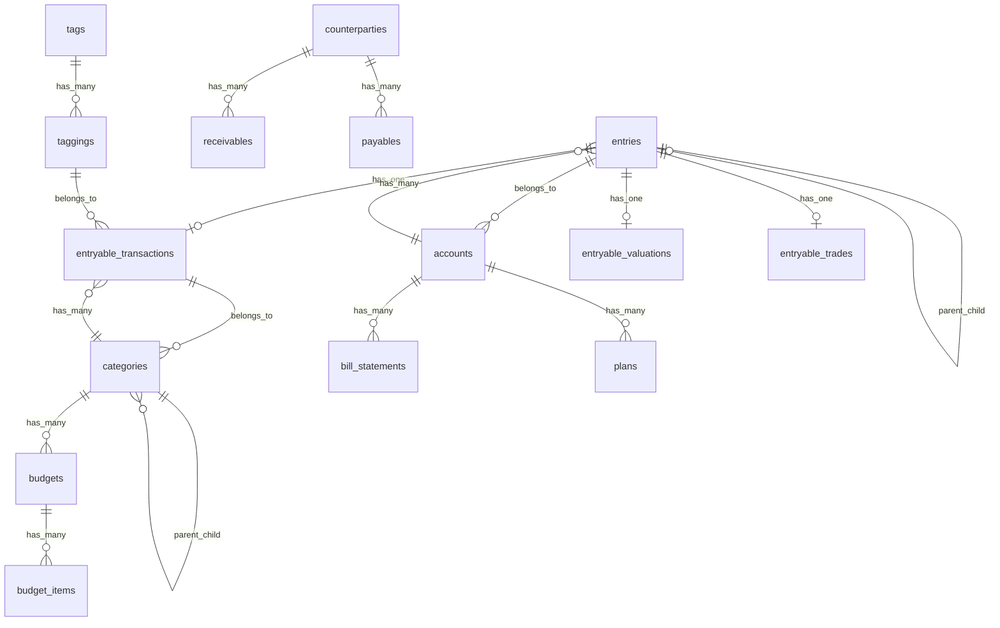

# Database Schema Guide

**更新日期**: 2026-05-05
**数据库**: PostgreSQL
**Rails 版本**: 8.1

## 概览

- **表数量**: ~25
- **主要设计模式**: Delegated Type, STI, JSONB
- **索引策略**: 复合索引、GIN 全文搜索、TRGM 模糊搜索

## 核心表

### entries (交易日志)

Entry 是系统的核心模型，使用 Rails delegated_type 支持多种交易类型。

| 列 | 类型 | 说明 |
|---|-----|------|
| id | bigint | 主键 |
| account_id | integer | 账户 FK (必填) |
| entryable_type | string | 多态类型 (Transaction/Valuation/Trade) |
| entryable_id | integer | 多态关联 ID |
| date | date | 交易日期 (必填) |
| name | string | 名称 (必填) |
| amount | decimal(19,4) | 金额 (必填) |
| currency | string(3) | 货币代码，默认 CNY |
| notes | text | 备注 |
| excluded | boolean | 是否排除统计 |
| transfer_id | string | 转账关联 UUID |
| parent_entry_id | integer | 父条目 ID (分割交易) |
| sort_order | integer | 排序顺序 |
| external_id | string | 外部系统 ID |
| source | string | 数据来源 |
| user_modified | boolean | 用户是否修改 |
| import_locked | boolean | 导入锁定 |
| locked_attributes | jsonb | 锁定属性 |
| extra | jsonb | 扩展数据 |

**重要索引**:
- `idx_entries_account_date` - 按账户和日期查询
- `idx_entries_entryable` - 多态关联查询
- `idx_entries_name_trgm` - 名称模糊搜索 (pg_trgm)
- `idx_entries_notes_trgm` - 备注模糊搜索 (pg_trgm)
- `idx_entries_transfer` - 转账查询

### accounts (账户)

支持多种账户类型 (STI 模式)。

| 列 | 类型 | 说明 |
|---|-----|------|
| id | bigint | 主键 |
| name | string | 名称 (唯一) |
| type | string | 类型: CASH/BANK/CREDIT/INVESTMENT/LOAN/DEBT |
| currency | string(3) | 货币代码 |
| initial_balance | decimal(10,2) | 初始余额 |
| hidden | integer | 是否隐藏 (0/1) |
| include_in_total | integer | 是否计入统计 |
| transactions_count | integer | 交易计数缓存 |
| last_transaction_date | date | 最后交易日期 |
| billing_day | integer | 账单日 (信用卡) |
| due_day | integer | 还款日 (信用卡) |
| credit_limit | decimal(10,2) | 信用额度 |
| extra | jsonb | 扩展数据 |

**重要索引**:
- `index_accounts_on_name` - 名称唯一性
- `idx_accounts_visibility` - 可见性查询
- `idx_accounts_last_trans_date` - 活跃排序

### categories (分类)

树形结构，支持收入/支出两种类型。

| 列 | 类型 | 说明 |
|---|-----|------|
| id | bigint | 主键 |
| name | string | 名称 |
| type | string | 类型: Expense/Income |
| parent_id | integer | 父分类 ID |
| level | integer | 层级深度 |
| sort_order | integer | 排序顺序 |
| active | boolean | 是否激活 |
| icon | string | 图标 |
| color | string(7) | 颜色 |
| extra | jsonb | 扩展数据 |

**重要索引**:
- `index_categories_on_name_and_parent_id` - 名称唯一性（同父级下）
- `index_categories_on_parent_id` - 树形查询
- `idx_categories_active_type` - 类型筛选

### entryable_transactions (交易明细)

Entry 的主要 delegated_type 实现。

| 列 | 类型 | 说明 |
|---|-----|------|
| id | bigint | 主键 |
| kind | string | 类型: expense/income |
| category_id | integer | 分类 FK |
| merchant_id | integer | 商户 FK |
| tags | jsonb | 标签数组 |
| locked_attributes | jsonb | 锁定属性 |
| extra | jsonb | 扩展数据 |

**重要索引**:
- `idx_trans_category` - 分类统计
- `idx_trans_tags_gin` - 标签搜索

### entryable_valuations (估值记录)

资产估值类型的 delegated_type。

### entryable_trades (投资交易)

投资交易类型的 delegated_type。

| 列 | 类型 | 说明 |
|---|-----|------|
| security_id | integer | 证券 ID |
| qty | decimal(19,4) | 数量 |
| price | decimal(19,4) | 价格 |

## ER 图 (Mermaid)



## 设计模式说明

### Delegated Type (Entry)

Entry 使用 Rails delegated_type 实现多态交易：

```ruby
# app/models/entry.rb
has_delegated_type :entryable, types: %w[ Entryable::Transaction Entryable::Valuation Entryable::Trade ]

# 使用方式
entry.transaction?  # 判断是否为普通交易
entry.valuation?    # 判断是否为估值
entry.trade?        # 判断是否为投资交易
```

**优势**:
- 单一表存储所有交易类型
- 共享通用字段 (date, amount, account)
- 各类型有独立扩展字段

### STI (Account)

Account 使用单表继承支持多种账户：

```ruby
# 类型常量
ACCOUNT_TYPES = { "CASH" => "现金", "BANK" => "储蓄卡", "CREDIT" => "信用卡" }

# 子类示例
class CreditAccount < Account
  # 信用卡特有逻辑
end
```

### 树形结构 (Category)

Category 使用 parent_id 自引用实现树形：

```ruby
# app/models/category.rb
has_many :children, class_name: 'Category', foreign_key: 'parent_id'
belongs_to :parent, class_name: 'Category', optional: true
```

**查询祖先**:
```ruby
Category.ancestor_ids_for([category_ids])  # 递归 CTE 查询
```

## JSONB 字段使用

系统广泛使用 PostgreSQL JSONB 存储扩展数据：

| 表 | 字段 | 用途 |
|---|-----|------|
| accounts | extra | 账户扩展配置 |
| accounts | locked_attributes | 锁定属性 |
| entries | extra | 交易扩展数据 |
| entries | locked_attributes | 导入锁定属性 |
| entryable_transactions | tags | 标签数组 |
| entryable_transactions | extra | 提供商数据等 |

**GIN 索引优化**:
```sql
CREATE INDEX idx_entries_extra_gin ON entries USING gin(extra);
CREATE INDEX idx_trans_tags_gin ON entryable_transactions USING gin(tags);
```

## 查询模式

### N+1 预防

```ruby
# 加载 Entry 及 Account
Entry.includes(:account)

# 加载 Entry 及转账对方账户
Entry.preload_transfer_accounts(entries)

# 加载 Category 及子分类
Category.includes(:children)
```

### 性能优化

```ruby
# 使用 exists? 而非 count
Account.where(hidden: false).exists?

# 明确指定列
Entry.select(:id, :amount, :date).where(...)

# 聚合在数据库层计算
Entry.where(account_id: 1).sum(:amount)
```

## 索引策略

### 复合索引顺序

遵循最左前缀原则：

```sql
-- idx_entries_account_date
-- 支持: WHERE account_id = X AND date >= Y
-- 支持: WHERE account_id = X
-- 不支持: WHERE date >= Y (单独)
```

### TRGM 全文搜索

使用 pg_trgm 扩展实现中文模糊搜索：

```sql
CREATE INDEX idx_entries_name_trgm ON entries USING gin(name gin_trgm_ops);
```

**效果**:
- 支持中文模糊匹配
- 支持拼音首字母搜索
- 支持部分匹配

---

**文档更新**: 随数据库迁移同步更新
**维护责任**: 开发团队