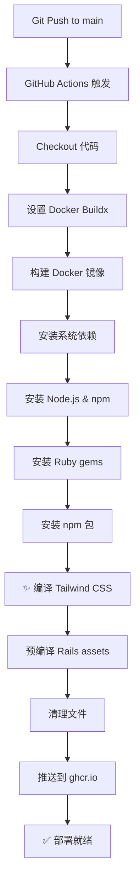

# ✅ GitHub Actions 自动编译 Tailwind CSS - 配置完成

## 已完成的配置

### 1. 更新 Dockerfile ✅

**位置**: `Dockerfile` 第 65-69 行

**修改**:
```dockerfile
# Precompile bootsnap code for faster boot times
RUN bundle exec bootsnap precompile -j 1 app/ lib/

# ✨ 编译 Tailwind CSS（新增）
RUN ./bin/build-css

# Precompiling assets for production
RUN SECRET_KEY_BASE_DUMMY=1 ./bin/rails assets:precompile
```

### 2. 更新 bin/build-css 脚本 ✅

**优化后的脚本**:
```bash
#!/bin/bash
# 1. 检查 Node.js
# 2. 安装 npm 依赖
# 3. 编译 Tailwind CSS
# 4. 合并样式文件
```

**改进**:
- ✅ 适配 Docker 环境
- ✅ 更好的错误处理
- ✅ 清晰的输出信息
- ✅ 支持无 custom.css 的情况

### 3. 更新 .gitignore ✅

**新增**:
```gitignore
app/assets/stylesheets/tailwind_output.css  # 编译输出（不追踪）
app/assets/stylesheets/application.css       # 最终文件（不追踪）
```

**原因**: 这些是编译生成的文件，不应该提交到 Git。

### 4. 提交必要文件 ✅

**已添加到 Git**:
- ✅ `app/assets/stylesheets/tailwind.css` (输入文件)
- ✅ `app/assets/stylesheets/custom.css` (自定义样式)
- ✅ `package.json` (npm 依赖)
- ✅ `tailwind.config.js` (Tailwind 配置)

---

## GitHub Actions 构建流程

### 自动触发条件

```yaml
on:
  push:
    branches: [main]      # 推送到 main 分支
  pull_request:
    branches: [main]      # PR 到 main 分支
```

### 完整构建流程



### Docker 构建详细步骤

```dockerfile
# 1. 基础镜像
FROM ruby:3.3.10-slim

# 2. 安装系统依赖
RUN apt-get install ... nodejs npm ...

# 3. 安装 Ruby gems
RUN bundle install

# 4. 安装 npm 包
RUN npm install --omit=dev

# 5. 编译 bootsnap
RUN bundle exec bootsnap precompile

# 6. ✨ 编译 Tailwind CSS（关键步骤）
RUN ./bin/build-css
    ↓
    🎨 编译 Tailwind CSS...
    📦 安装 npm 依赖（如果需要）
    ⚙️  编译 Tailwind...
       - 输入: tailwind.css
       - 输出: tailwind_output.css
    🔗 合并样式文件...
       - tailwind_output.css + custom.css → application.css
    ✅ Tailwind CSS 编译完成！

# 7. 预编译 Rails assets
RUN rails assets:precompile

# 8. 清理 node_modules
RUN rm -rf node_modules
```

---

## 验证方法

### 方法 1: 查看 GitHub Actions 日志

**步骤**:
1. 推送代码到 GitHub
2. 访问 `https://github.com/YOUR_USERNAME/ledger/actions`
3. 点击最新的 workflow run
4. 展开 "Build and push Docker image" 步骤
5. 搜索 "Tailwind" 关键字

**预期输出**:
```
🎨 编译 Tailwind CSS...
⚙️  编译 Tailwind...
🔗 合并样式文件...
✅ Tailwind CSS 编译完成！
```

### 方法 2: 本地 Docker 构建

**命令**:
```bash
# 构建（查看详细日志）
docker build --progress=plain -t ledger-test . 2>&1 | grep "Tailwind"

# 预期输出：
# 🎨 编译 Tailwind CSS...
# ✅ Tailwind CSS 编译完成！
```

### 方法 3: 检查镜像内容

**命令**:
```bash
# 运行容器并检查 CSS
docker run --rm ledger-test \
  ls -lh /rails/app/assets/stylesheets/

# 应该看到：
# -rw-r--r-- 1 rails rails 63K application.css
# -rw-r--r-- 1 rails rails 23K custom.css
# -rw-r--r-- 1 rails rails  52 tailwind.css
```

**检查 CSS 内容**:
```bash
docker run --rm ledger-test \
  head -1 /rails/app/assets/stylesheets/application.css

# 应该看到：
# /*! tailwindcss v3.4.1 | MIT License | https://tailwindcss.com */
```

---

## 提交和推送

### 提交修改

```bash
# 查看修改
git status

# 添加修改的文件
git add Dockerfile \
        bin/build-css \
        .gitignore \
        app/assets/stylesheets/tailwind.css \
        app/assets/stylesheets/custom.css

# 提交
git commit -m "feat: Add Tailwind CSS compilation to Docker build

- Add bin/build-css script for Tailwind compilation
- Update Dockerfile to compile Tailwind before assets:precompile
- Add tailwind.css input file and custom.css to Git
- Update .gitignore to exclude compiled output files

This ensures Tailwind CSS is compiled automatically during
Docker image build in GitHub Actions."

# 推送
git push origin main
```

### 查看 GitHub Actions 运行

推送后访问:
```
https://github.com/YOUR_USERNAME/ledger/actions
```

点击最新的 workflow，应该看到：

```
✅ Build and push Docker image
  ├─ ✅ Checkout repository
  ├─ ✅ Set up QEMU
  ├─ ✅ Set up Docker Buildx
  ├─ ✅ Log in to Container Registry
  ├─ ✅ Extract metadata
  ├─ ✅ Build and push Docker image
  │   ├─ 🎨 编译 Tailwind CSS...
  │   ├─ ⚙️  编译 Tailwind...
  │   ├─ 🔗 合并样式文件...
  │   └─ ✅ Tailwind CSS 编译完成！
  └─ ✅ Show image size
```

---

## 多平台支持

### 构建平台

```yaml
platforms: linux/amd64,linux/arm64
```

**支持**:
- ✅ `linux/amd64` - 传统 x86_64 服务器
- ✅ `linux/arm64` - Apple Silicon, AWS Graviton, 树莓派

**Tailwind 兼容性**:
- ✅ 纯 JavaScript 编译，跨平台兼容
- ✅ 无原生依赖，无需额外配置

---

## 镜像大小预估

### 优化后的大小

```
基础镜像 (ruby:3.3.10-slim)    ~150 MB
Rails 应用 + gems              ~200 MB
编译后的 assets (含 Tailwind)   ~5-10 MB
系统库 (jemalloc, libvips)     ~30 MB
────────────────────────────────────────
总计                           ~385-390 MB
```

### 对比 CDN 方式

| 方式 | 大小 | 优点 | 缺点 |
|------|------|------|------|
| CDN | ~350 MB | 镜像稍小 | 依赖外部CDN |
| 本地编译 | ~390 MB | 完全独立 | +40 MB |

**推荐**: 本地编译（更可靠，性能更好）

---

## 故障排查

### 问题 1: 找不到 tailwind.css

**错误**:
```
Error: Can't find './app/assets/stylesheets/tailwind.css'
```

**解决**:
```bash
git add app/assets/stylesheets/tailwind.css
git commit -m "Add Tailwind CSS input file"
git push
```

### 问题 2: npm 包未安装

**错误**:
```
module.js:478
  throw err;
  ^
Error: Cannot find module 'tailwindcss'
```

**解决**: 检查 Dockerfile 第 55-57 行是否执行了 `npm install`

### 问题 3: 权限错误

**错误**:
```
/bin/sh: 1: ./bin/build-css: Permission denied
```

**解决**:
```bash
chmod +x bin/build-css
git add bin/build-css
git commit -m "Fix build-css permission"
git push
```

---

## 总结

✅ **配置完成，GitHub Actions 会自动编译 Tailwind CSS**

### 关键修改

1. ✅ Dockerfile 第 65 行: `RUN ./bin/build-css`
2. ✅ bin/build-css 脚本优化
3. ✅ .gitignore 更新
4. ✅ 必要文件已提交

### 下一步

```bash
# 1. 提交修改
git add -A
git commit -m "feat: Add Tailwind CSS compilation to Docker build"
git push

# 2. 查看 GitHub Actions
# 访问 https://github.com/YOUR_USERNAME/ledger/actions

# 3. 验证构建日志
# 应该看到 "✅ Tailwind CSS 编译完成！"
```

**🎉 推送后 GitHub Actions 会自动构建包含完整 Tailwind CSS 的 Docker 镜像！**